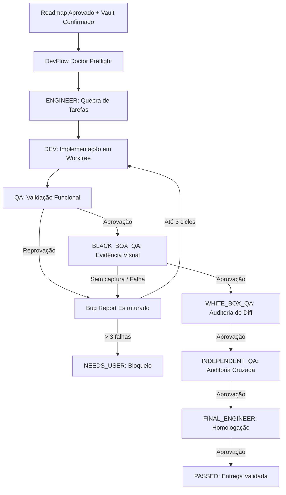

<div align="center">

# DevFlow MCP

**Infraestrutura local de orquestração autônoma orientada a agentes com esteira determinística de Engenharia, Desenvolvimento e QA em múltiplos gates.**

[](https://github.com/JoaoPauloNA/DevFlow-MCP)
[](https://www.python.org/)
[](tests/)
[](config/)
[](#licença)

<p align="center">
  Execução autônoma de roadmaps de software com isolamento em Git Worktrees, governança estrita de qualidade, evidências observáveis reais de navegador e roteamento declarativo de modelos de IA.
</p>

</div>

---

## Comece em um minuto

### 1. Clonar e preparar o ambiente

```bash
git clone https://github.com/JoaoPauloNA/DevFlow-MCP.git
cd DevFlow-MCP
```

### 2. Configurar variáveis de ambiente e chaves

Copie o arquivo de exemplo e defina as referências das suas chaves de API:

```bash
cp .env.example .env
```

Defina as variáveis de ambiente referenciadas em `config/agent-routing.json`:
```bash
export CLIPROXY_API_KEY="sua_chave_aqui"
```

### 3. Validar a saúde do sistema e do roteamento

Execute o diagnóstico completo com o **DevFlow Doctor**:

```bash
python3 scripts/devflow_cli.py doctor
```

### 4. Executar os serviços locais

Inicie o servidor MCP e o Worker autônomo:

```bash
# Terminal 1: Iniciar servidor MCP local (porta 8788)
python3 scripts/devflow_mcp.py

# Terminal 2: Iniciar worker autônomo
python3 scripts/devflow_worker.py
```

---

## Por que o DevFlow existe

A automação de desenvolvimento de software por modelos de IA exige mais do que geração isolada de código; requer **governança de qualidade, separação estrita de responsabilidades e provas observáveis de execução**.

O DevFlow resolve o problema da aprovação alucinatória (*"parece correto"*) implementando um ciclo determinístico e verificável:

```
Roadmap Aprovado
       │
       ▼
[ENGINEER]  ──► Quebra em tarefas com critérios de aceite explícitos
       │
       ▼
  [DEV]     ──► Implementa alterações em Git Worktree isolada
       │
       ▼
   [QA]     ──► Validação mecânica e testes unitários
       │
       ▼
[BLACK_BOX] ──► Validação observável externa (exige captura real de navegador)
       │
       ▼
[WHITE_BOX] ──► Auditoria de integridade do diff e conformidade
       │
       ▼
  [IQA]     ──► Auditoria independente cruzada
       │
       ▼
 [FINAL]    ──► Homologação final do roadmap (sem codificar)
       │
       ▼
 [PASSED]   ──► Entrega certificada com relatórios e evidências SHA-256
```

---

## O que ele faz

| Funcionalidade | Descrição |
| :--- | :--- |
| **Declarative Agent Routing (v1.2)** | Roteamento desacoplado do código via JSON Schema, suportando $N$ candidatos ordenados por papel e conexões flexíveis. |
| **Routing Snapshot Imutável** | Cada workflow congela a configuração e o hash SHA-256 no momento da criação, blindando execuções ativas contra alterações de hot-config. |
| **Isolamento via Git Worktrees** | Cada workflow opera em uma worktree Git temporária isolada, preservando a integridade da branch de trabalho. |
| **Pipeline Sequencial de 5 Gates** | `QA` $\rightarrow$ `BLACK_BOX_QA` $\rightarrow$ `WHITE_BOX_QA` $\rightarrow$ `INDEPENDENT_QA` $\rightarrow$ `FINAL_ENGINEER`. |
| **Bug Report Loop Determinístico** | Reprovações em qualquer gate geram um Bug Report estruturado e retornam a tarefa diretamente para `DEV` (limite de 3 ciclos de correção). |
| **Evidências Visuais Reais** | Proibição estrita de aprovações decorativas. Gates de caixa-preta exigem renderização e captura real via navegador. |
| **Persistência Auditável** | SQLite de runtime (`runtime/devflow.sqlite3`) registra workflows, tarefas, execuções com tokens/tempo, eventos e metadados de artefatos. |
| **DevFlow Doctor Integrado** | Diagnóstico pré-voo de configuração de rotas, integridade do banco de dados e capacidade Git. |
| **Compatibilidade Total v1.1** | Suporte automático a configurações legadas `roles.json` com conversão em memória e ferramenta de migração CLI. |

---

## Fluxo Operacional



---

## Roteamento Declarativo (v1.2.0)

O DevFlow v1.2 organiza a resolução de modelos em três conceitos canônicos:

1. **Connection (`connections`)**: Endpoints de provedores ou proxies (ex: OpenAI-compatible, custom HTTP).
2. **Candidate (`candidates`)**: Par indissociável `connection` + `model`, com retries técnicos e hiperparâmetros próprios.
3. **Role (`roles`)**: Definição sequencial de candidatos para cada papel ou qualificador de área/complexidade.

### Exemplo de Configuração Segura (`config/agent-routing.json`)

```json
{
  "schema_version": 1,
  "default_fallback_on": [
    "PROVIDER_UNAVAILABLE",
    "RATE_LIMITED",
    "TIMEOUT",
    "INVALID_JSON",
    "HTTP_ERROR"
  ],
  "connections": {
    "primary-gateway": {
      "type": "openai-compatible",
      "base_url": "http://127.0.0.1:8321/v1",
      "auth": {
        "type": "env",
        "env": "CLIPROXY_API_KEY"
      },
      "quota_group": "primary",
      "enabled": true,
      "timeout": 180
    },
    "backup-gateway": {
      "type": "openai-compatible",
      "base_url": "http://127.0.0.1:8311/v1",
      "auth": {
        "type": "env",
        "env": "CLIPROXY_BACKUP_KEY"
      },
      "quota_group": "backup",
      "enabled": true,
      "timeout": 180
    }
  },
  "roles": {
    "ENGINEER": {
      "strategy": "sequential",
      "candidates": [
        {
          "id": "engineer-primary",
          "connection": "primary-gateway",
          "model": "gpt-5.6-terra-medium",
          "enabled": true,
          "technical_retries": 1
        },
        {
          "id": "engineer-backup",
          "connection": "backup-gateway",
          "model": "gpt-5.6-sol-medium",
          "enabled": true,
          "technical_retries": 1
        }
      ]
    }
  }
}
```

---

## Regras de Fallback vs. Bugs de Produto

* **Fallback Técnico:** Se o candidato `primary` falhar por erro de rede (503, timeout, rate limit ou resposta JSON corrompida), o router realiza os retries técnicos configurados e, se esgotados, avança para o candidato `backup`.
* **Não-Fallback em Bug de Produto:** Se o modelo retornar um código com erro ou teste que falhou (`QA_FAIL`, `ACCEPTANCE_CRITERIA_FAIL`), isso é tratado como **defeito de desenvolvimento**. O sistema gera um Bug Report e retorna para `DEV` — **nunca** troca de modelo por causa de um bug de código.

---

## Requisitos

* **Sistema Operacional:** macOS 13+ ou Linux x86_64 / arm64.
* **Python:** Python 3.9 ou superior (testado e homologado com Python 3.14).
* **Git:** Git 2.30+ com suporte a `git worktree`.
* **Navegador (Opcional para QA Visual):** Brave Browser ou Chromium instalado para capturas headless reais.

---

## Estrutura do Projeto

```text
DevFlow-MCP/
├── config/
│   ├── agent-routing.json          # Configuração declarativa canônica v1.2
│   ├── agent-routing.schema.json   # JSON Schema formal Draft-07
│   └── roles.json                  # Configuração legada v1.1 (compatibilidade)
├── devflow/
│   ├── config.py                   # Loader, validador de segredos e hashes
│   ├── db.py                       # Persistência SQLite e auditoria
│   ├── doctor.py                   # Diagnóstico DevFlow Doctor
│   ├── executor.py                 # ProviderExecutor desacoplado
│   ├── local_mcp.py                # MCPs auxiliares (Git e Browser)
│   ├── mcp_server.py               # Servidor MCP HTTP (porta 8788)
│   ├── migration.py                # Utilitário de migração v1.1 -> v1.2
│   ├── reporting.py                # Geração de relatórios e integração com Vault
│   ├── router.py                   # Declarative RoleRouter e circuit breaker
│   ├── tools.py                    # Tool runtime de execução restrita
│   ├── visual.py                   # Gate de inspeção e capturas reais
│   └── worker.py                   # Worker autônomo da máquina de estados
├── launchd/                        # Plists para execução em background (macOS)
├── scripts/
│   ├── devflow_cli.py              # CLI para doctor e migração
│   ├── devflow_mcp.py              # Entrypoint do servidor MCP
│   ├── devflow_worker.py           # Entrypoint do worker
│   └── run_shadow_canary.py        # Validador de Shadow Canary isolado
└── tests/
    ├── run_tests.py                # Runner unificado de testes
    ├── test_devflow.py             # Testes de regressão v1.1
    └── test_v12_declarative_routing.py # Suíte unitária e integração v1.2
```

---

## Desenvolvimento e Testes

Execute a suíte completa de testes unitários e de integração:

```bash
python3 tests/run_tests.py
```

### Resultados da Suíte Automatizada:

```text
========================================
 DevFlow MCP Test Suite (v1.2.0)
========================================

--- Executando Testes Legados v1.1 ---
PASS test_exact_model_matrix
PASS test_json_envelope_accepts_model_trailing_text
PASS test_unknown_vault_needs_user_without_creating_a_folder

--- Executando Suíte Declarative Routing v1.2 ---
test_01_valid_json_config ... ok
test_02_invalid_json_config ... ok
test_03_unknown_connection_rejected ... ok
test_04_unknown_role_handling ... ok
test_05_empty_model_rejected ... ok
test_06_literal_secret_rejected ... ok
test_07_n_candidates_supported ... ok
test_08_candidate_order_preserved ... ok
test_09_candidate_1_pass ... ok
test_10_candidate_1_fail_fallback_to_candidate_2 ... ok
test_11_candidate_2_fail_fallback_to_candidate_3 ... ok
test_12_invalid_json_technical_retry ... ok
test_13_technical_retry_exhausted_fallback ... ok
test_14_code_fail_does_not_cause_fallback ... ok
test_15_workflow_routing_snapshot_persisted ... ok
test_16_json_mutation_does_not_affect_active_workflow ... ok
test_17_new_workflow_picks_up_new_config ... ok
test_18_sha256_persisted_and_verified ... ok
test_19_backward_compatibility_v11 ... ok
test_20_migration_tool ... ok
test_21_model_mapping_unchanged ... ok
test_22_doctor_routing_validation ... ok
test_23_integration_simulated_connections_a_b_c ... ok
test_24_workflow_immutability_execution ... ok

========================================
Total executado: 27 testes
Sucessos: 27
Falhas: 0
========================================
```

---

<details>
<summary><strong>Detalhes Técnicos e Blindagem de Segurança (Clique para expandir)</strong></summary>

### 1. Governança de Segredos
- **Zero Segredos em Código ou Configuração:** Arquivos JSON e repositórios contêm apenas referências nominais de variáveis de ambiente (`auth.env`).
- **Validação Estrita:** O loader de configuração rejeita qualquer valor literal que se assemelhe a tokens ou senhas (`RoutingConfigError`).
- **Sanitização de Artefatos:** Paths locais, parâmetros confidenciais e credenciais são expurgados antes da emissão de relatórios Markdown.

### 2. Imutabilidade e Proveniência SHA-256
- Todo relatório Markdown e captura de tela de navegador recebe cálculo de hash SHA-256 no momento da escrita e é registrado na tabela `artifacts` do SQLite.
- O routing snapshot do workflow assegura auditabilidade exata sobre qual modelo e conexão executou cada etapa histórica.

### 3. Circuit Breaker e Quota Cooldown
- Falhas com código 429 ou esgotamento de cota ativam automaticamente um período de resfriamento (*cooldown*) registrado na tabela `provider_health`, evitando chamadas inúteis ao provedor temporariamente indisponível.

</details>

---

## Histórico de Versões

### v1.2.0 (Versão Atual)
* **Declarative Agent Routing:** Desacoplamento total de modelos, conexões e rotas para `config/agent-routing.json`.
* **JSON Schema Formal Draft-07:** Validação estrutural de conexões, candidatos e papéis.
* **$N$ Candidatos por Papel:** Suporte a listas arbitrárias e ordenadas de fallback.
* **Retries Técnicos Granulares:** Retry local dentro do mesmo candidato para falhas transitórias.
* **Routing Snapshot Imutável:** Congelamento da configuração e hash SHA-256 por workflow.
* **Backward Compatibility v1.1:** Suporte automático e ferramenta de migração CLI para `roles.json`.
* **DevFlow Doctor com Roteamento:** Diagnóstico aprofundado de conexões e esquemas.

### v1.1.0
* **Multi-Gate QA Pipeline:** Implementação de `QA`, `BLACK_BOX_QA`, `WHITE_BOX_QA`, `INDEPENDENT_QA` e `FINAL_ENGINEER`.
* **Evidências Reais de Navegador:** Integração com Brave Browser para captura de telas reais.
* **Persistência de Artefatos:** Armazenamento estruturado no Vault (`08-QA-e-Auditoria/`) com hashes SHA-256.
* **Proteção por Worktree Git:** Execução de tarefas isoladas sem alteração direta no checkout principal.

---

## Roadmap Futuro

- [ ] **Specialist Gateway Adapter:** Conexão nativa padronizada para microespecialistas de contexto ultracompacto (ex: CSS Specialist, DB Specialist).
- [ ] **Roteamento por Capacidades:** Seleção dinâmica baseada em requisitos de contexto (ex: modelos com suporte nativo a visão computacional).
- [ ] **Métricas Históricas Agregadas:** Dashboard de observabilidade de latência, taxa de fallbacks e custo por token.

---

## Licença

`LICENSE_DECISION_REQUIRED` — Definição de licença pendente de homologação pelo proprietário do projeto.
