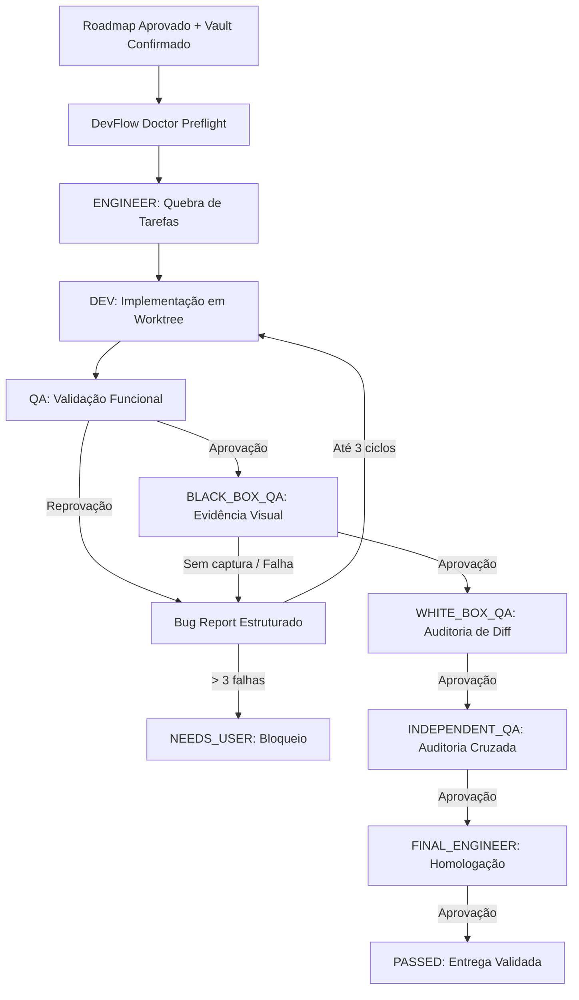

<div align="center">

# DevFlow MCP

**Infraestrutura local de orquestração autônoma orientada a agentes com esteira determinística de Engenharia, Desenvolvimento e QA em múltiplos gates.**

[](https://github.com/JoaoPauloNA/DevFlow-MCP)
[](https://www.python.org/)
[](tests/)
[](config/)
[](#licença)

<p align="center">
  Execução autônoma de roadmaps de software com isolamento em Git Worktrees, governança estrita de qualidade, evidências observáveis reais de navegador e roteamento declarativo multi-transporte de modelos de IA.
</p>

</div>

---

## Comece em um minuto

### 1. Clonar e preparar o ambiente

```bash
git clone https://github.com/JoaoPauloNA/DevFlow-MCP.git
cd DevFlow-MCP
```

### 2. Configurar variáveis de ambiente e chaves

Copie o arquivo de exemplo e defina as referências das suas chaves de API:

```bash
cp .env.example .env
```

Defina as variáveis de ambiente referenciadas em `config/agent-routing.json`:
```bash
export OPENAI_API_KEY="sua_chave_aqui"
```

### 3. Validar a saúde do sistema e do roteamento

Execute o diagnóstico completo com o **DevFlow Doctor**:

```bash
python3 scripts/devflow_cli.py doctor
```

### 4. Executar os serviços locais

Inicie o servidor MCP e o Worker autônomo:

```bash
# Terminal 1: Iniciar servidor MCP local (porta 8788)
python3 scripts/devflow_mcp.py

# Terminal 2: Iniciar worker autônomo
python3 scripts/devflow_worker.py
```

---

## Por que o DevFlow existe

A automação de desenvolvimento de software por modelos de IA exige mais do que geração isolada de código; requer **governança de qualidade, separação estrita de responsabilidades e provas observáveis de execução**.

O DevFlow resolve o problema da aprovação alucinatória (*"parece correto"*) implementando um ciclo determinístico e verificável:

```
Roadmap Aprovado
       │
       ▼
[ENGINEER]  ──► Quebra em tarefas com critérios de aceite explícitos
       │
       ▼
  [DEV]     ──► Implementa alterações em Git Worktree isolada
       │
       ▼
   [QA]     ──► Validação mecânica e testes unitários
       │
       ▼
[BLACK_BOX] ──► Validação observável externa (exige captura real de navegador)
       │
       ▼
[WHITE_BOX] ──► Auditoria de integridade do diff e conformidade
       │
       ▼
  [IQA]     ──► Auditoria independente cruzada
       │
       ▼
 [FINAL]    ──► Homologação final do roadmap (sem codificar)
       │
       ▼
 [PASSED]   ──► Entrega certificada com relatórios e evidências SHA-256
```

---

## O que ele faz

| Funcionalidade | Descrição |
| :--- | :--- |
| **Declarative Multi-Transport Routing (v1.3)** | Roteamento desacoplado do código via JSON Schema, suportando **Proxy**, **Direct CLI** e **Direct API**. |
| **Routing Snapshot Imutável** | Cada workflow congela a configuração e o hash SHA-256 no momento da criação, blindando execuções ativas. |
| **Isolamento via Git Worktrees** | Cada workflow opera em uma worktree Git temporária isolada, preservando a integridade da branch de trabalho. |
| **Pipeline Sequencial de 5 Gates** | `QA` $\rightarrow$ `BLACK_BOX_QA` $\rightarrow$ `WHITE_BOX_QA` $\rightarrow$ `INDEPENDENT_QA` $\rightarrow$ `FINAL_ENGINEER`. |
| **Bug Report Loop Determinístico** | Reprovações em qualquer gate geram um Bug Report estruturado e retornam a tarefa diretamente para `DEV`. |
| **Evidências Visuais Reais** | Proibição estrita de aprovações decorativas. Gates de caixa-preta exigem renderização e captura real via navegador. |
| **Persistência Auditável** | SQLite de runtime (`runtime/devflow.sqlite3`) registra workflows, tarefas, execuções com tokens/tempo, eventos e metadados. |
| **DevFlow Doctor Integrado** | Diagnóstico pré-voo de configuração de rotas, integridade do banco de dados e capacidade Git. |
| **Compatibilidade Total v1.1** | Suporte automático a configurações legadas `roles.json` com conversão em memória e ferramenta de migração CLI. |

---

## Fluxo Operacional



---

## Roteamento Declarativo Multi-Transport (v1.3.0)

O DevFlow v1.3 organiza a resolução de modelos em três conceitos canônicos:

1. **Connection (`connections`)**: Transporte físico (Proxy, Direct CLI, Direct API), provedor e protocolo (ex: OpenAI Chat, Codex CLI).
2. **Candidate (`candidates`)**: Par indissociável `connection` + `model`, com retries técnicos e hiperparâmetros próprios.
3. **Role (`roles`)**: Definição sequencial de candidatos para cada papel ou qualificador de área/complexidade.

### Estrutura conceitual
`Role` -> `Candidate` (Connection + Model) -> `Transport` (Proxy/CLI/API) -> `Protocol Adapter`

Consulte `docs/routing.md` para a referência técnica completa.

---

## Requisitos

* **Sistema Operacional:** macOS 13+ ou Linux x86_64 / arm64.
* **Python:** Python 3.9 ou superior.
* **Git:** Git 2.30+ com suporte a `git worktree`.
* **Navegador (Opcional para QA Visual):** Brave Browser ou Chromium instalado para capturas headless reais.

---

## Estrutura do Projeto

```text
DevFlow-MCP/
├── config/
│   ├── agent-routing.json          # Configuração declarativa v2
│   └── agent-routing.schema.json   # JSON Schema formal Draft-07
├── devflow/
│   ├── adapters.py                 # Protocol adapters (OpenAI, Anthropic, etc)
│   ├── config.py                   # Loader e validador de configuração
│   ├── db.py                       # Persistência SQLite e auditoria
│   ├── doctor.py                   # Diagnóstico DevFlow Doctor
│   ├── executor.py                 # Decoupled Dispatcher (Proxy, CLI, API)
│   ├── migration.py                # Utilitário de migração
│   ├── router.py                   # Declarative RoleRouter
│   └── worker.py                   # Worker autônomo
├── docs/
│   └── routing.md                  # Referência técnica de roteamento
├── scripts/
│   ├── devflow_cli.py              # CLI para doctor e migração
│   └── ...
└── tests/
    └── ...
```

---

## Histórico de Versões

### v1.3.0 (Versão Atual)
* **Declarative Multi-Transport Routing:** Suporte oficial a `proxy`, `direct-cli` e `direct-api`.
* **Arquitetura de Protocol Adapters:** Normalização de requests/responses de múltiplos provedores.
* **Direct CLI Executor:** Execução segura de ferramentas locais via subprocess.
* **Validação de Roteamento:** Doctor com verificação de transports, protocolos e probes locais.

### v1.2.0
* **Declarative Agent Routing:** Roteamento inicial desacoplado do código.
* **Routing Snapshot Imutável:** Congelamento por workflow.

---

## Licença

`LICENSE_DECISION_REQUIRED` — Definição de licença pendente de homologação pelo proprietário do projeto.
